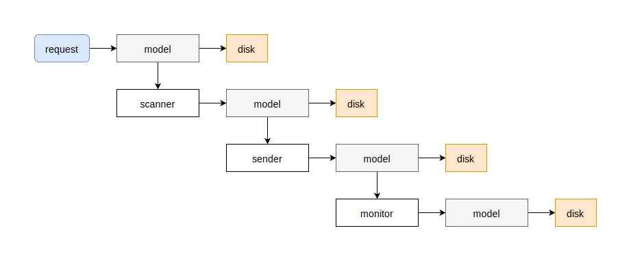
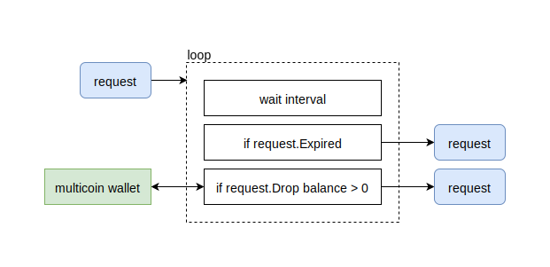
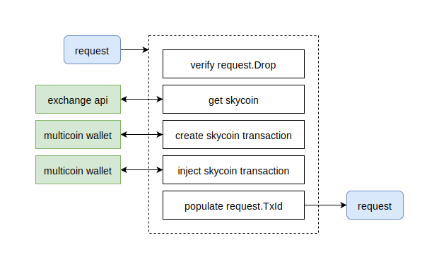

# teller

	

## scanner

	

The **scanner** continuously checks the balance of a `request.Drop` and returns when the balance is greater than zero (user made a deposit), or the request has expired (hours/days with no activity).

### possible errors

* Getting balance of `request.Drop` from multicoin wallet service.

## sender

	

## monitor

	

